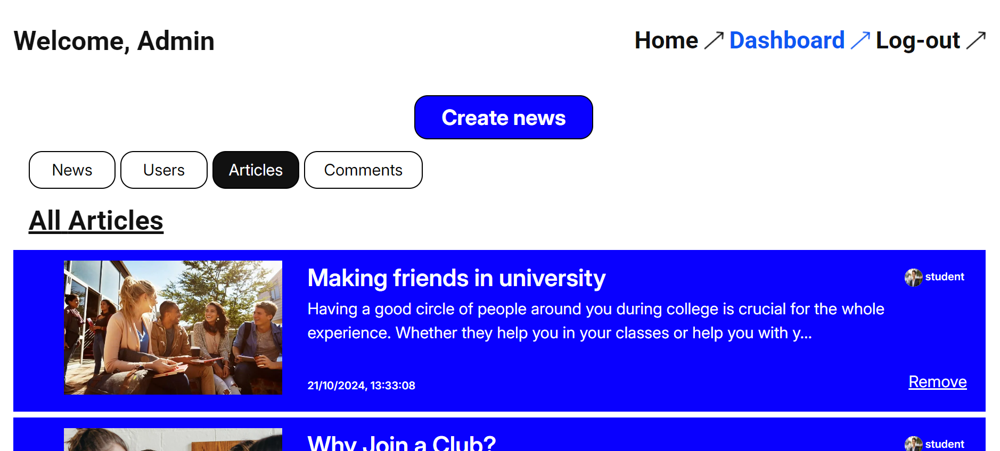

<br />

<br />

# University Blog Platform 🎓

As a **Full Stack Developer**, I designed and developed a **University Blog Platform** to facilitate communication and engagement between students and administrators. The platform offers a range of functionalities to streamline content management and enhance user interaction.

---

## ✨ **Features**

### **For Administrators:**
- **Secure Authentication:** Register and authenticate admin accounts using JWT (JSON Web Tokens).
- **Admin Dashboard:**
  - Manage users (add/remove).
  - Manage articles (add, update, consult, delete).
  - Manage comments (consult, delete).

### **For Students:**
- **Secure Authentication:** Register and authenticate student accounts using JWT.
- **Student Portal:**
  - Access the latest university news and student posts.
  - Publish articles related to university life.
  - Post, consult, and delete comments on articles.

### **General Features:**
- **Responsive Design:** Built with React.js and Tailwind CSS for a seamless user experience across devices.
- **RESTful APIs:** Implemented using Node.js and Express.js for efficient communication between the frontend and backend.
- **Efficient Data Storage:** Utilized PostgreSQL for reliable data storage and retrieval.

---

## 🛠️ **Technologies Used**

- **Frontend:** React.js, Tailwind CSS
- **Backend:** Node.js, Express.js
- **Database:** PostgreSQL
- **Authentication:** JWT (JSON Web Tokens)
- **Design:** Figma (for wireframes and prototypes)
- **Development Tools:** VS Code, Git, Postman

---

## 🚀 **Getting Started**

### Prerequisites
- Node.js and PostgreSQL installed.

### Installation
1. Clone the repository:
   ```bash
   git clone https://github.com/taif-kh/university-blog.git
   ```
2. Install dependencies for the frontend and backend:
   ```bash
    cd university-blog/frontend
    npm install
    cd ../backend
    npm install
   ```
3. Set up Prisma:
- Install the Prisma CLI globally (if not already installed):

    ```bash
    npm install -g prisma
    ```
- Generate the Prisma client:

    ```bash
    npx prisma generate
    ```
- Apply database migrations:

    ```bash
    npx prisma migrate dev --name init
    ```

4. Configure environment variables:

- Copy .env.example to .env:
    ```bash
    cp .env.example .env
    ```
- Open .env and fill in the required values:
 Replace [user], [password], [hostname], and [dbname] in DATABASE_URL with your PostgreSQL credentials.
5. Start the backend and frontend:
   ```bash
    node --watch app.js
    cd ../frontend
    npm run dev
   ```

## 📂 Project Structure

```bash
where-is-the-album/
├── backend/             # Backend API (Node.js, Express.js)
│   ├── prisma/          # Prisma schema and migrations
│   ├── routes/          # API endpoints
│   ├── .env.example     # Environment variables template
│   ├── app.js           # Entry point for the backend
│   └── package.json     # Backend dependencies
├── frontend/            # Demo client (React.js)
│   ├── public/          # Static assets
│   ├── src/             # Source code for the frontend
│   │   └── App.jsx      # Main application file
│   └── package.json     # Frontend dependencies
└── README.md            # Project documentation
```

## 📄 **License**

This project is licensed under the **MIT License**. For more details, see <a href="https://opensource.org/licenses/MIT" target="_blank" rel="noopener">https://opensource.org/licenses/MIT</a>.

## 🙏 Acknowledgments

- React.js and Tailwind CSS for building a responsive and interactive frontend.
- PostgreSQL for reliable data storage and retrieval.
- The web development community for endless resources and support.

Made with ❤️ by Taif Khaskhoussi. Let's connect on <a href="https://www.linkedin.com/in/taif-khaskhoussi/" target="_blank" rel="noopener">LinkedIn</a>!